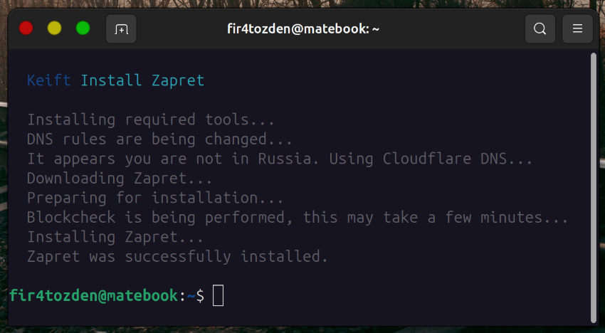

# Zapret - One step, bypass DPI barriers

Install Zapret in one step.

## Installation

You can install it as follows.

```shell
curl -fsSL https://is.gd/U95wCm | bash
```

## Uninstall

This is how you can uninstall Zapret.

```shell
curl -fsSL https://is.gd/lxqryq | bash
```

## Screenshots

Here it is.


