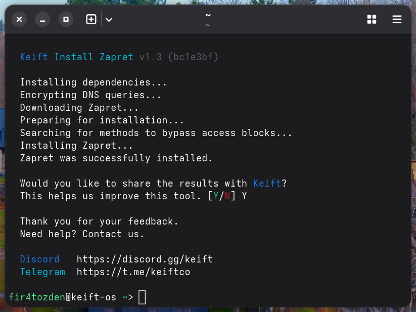

# Zapret - One Step, Bypass DPI Barriers

Install Zapret in one step.

## Installation

You can install it as follows.

```shell
curl -fsSL https://raw.github.com/keift/zapret/refs/heads/main/src/install.sh | bash
```

## Uninstall

You can uninstall it as follows.

```shell
curl -fsSL https://raw.github.com/keift/zapret/refs/heads/main/src/uninstall.sh | bash
```

## Screenshots

Here it is.



## Parameters

Installation settings can be changed in the following ways.

> | Parameter             | Default     | Description                                                                                                                                                                                     |
> | --------------------- | ----------- | ----------------------------------------------------------------------------------------------------------------------------------------------------------------------------------------------- |
> | `--dnscrypt`          | `false`     | This tool first checks if DNS-Over-TLS is available. If the DNS-Over-TLS protocol is unavailable, it uses the DNSCrypt protocol. This parameter specifies that it must use DNSCrypt regardless. |
> | `--blockcheck-domain` | _automatic_ | This tool finds the correct domain name by sequentially testing blocked websites in different countries for blockcheck. This parameter allows you to specify this domain name yourself.         |
>
> Example:
>
> ```shell
> curl -fsSL https://raw.github.com/keift/zapret/refs/heads/main/src/install.sh | bash -s -- --dnscrypt --clean --blockcheck-domain discord.com
> ```
